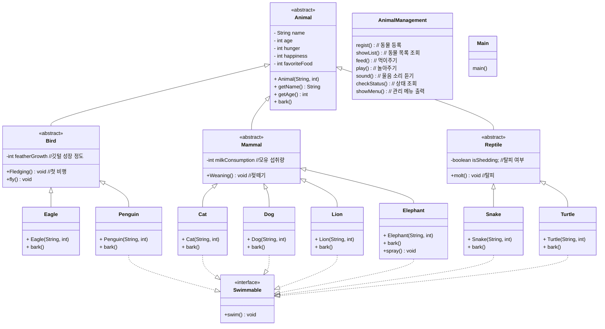

# AnimalManager
사전캠프 최종 과제: 동물 관리 시스템 만들기

```mermaid
classDiagram

class Animal {
	<<abstract>>
  - String name
  - int age
  - int hunger
  - int happiness
  - int favoriteFood
  + Animal(String, int)
  + getName() String
  + getAge() int
  + bark()
}

class Bird {
	<<abstract>>
	-int featherGrowth //깃털 성장 정도
	+Fledging() void //첫 비행
	+fly() void
}

class Mammal {
	<<abstract>>
	-int milkConsumption //모유 섭취량
	+Weaning() void //젖떼기
}

class Reptile {
	<<abstract>>
	-boolean isShedding; //탈피 여부
	+molt() void //탈피
}

class Swimmable {
	<<interface>>
	+swim() void
}


class Eagle {
  + Eagle(String, int)
  + bark()
}

class Penguin {
  + Penguin(String, int)
  + bark()
}

class Lion {
  + Lion(String, int)
  + bark()
}

class Elephant {
  + Elephant(String, int)
  + bark()
  +spray() void
}

class Snake {
  + Snake(String, int)
  + bark()
}

class Turtle {
  + Turtle(String, int)
  + bark()
}

class Dog {
  + Dog(String, int)
  + bark()
}

class Cat {
  + Cat(String, int)
  + bark() 
}

class AnimalManagement{
  regist() // 동물 등록
  showList() // 동물 목록 조회 
  feed() // 먹이주기
  play() // 놀아주기
  sound() // 울음 소리 듣기 
  checkStatus() // 상태 조회
  showMenu() // 관리 메뉴 출력
}

class Main {
	main()
}

Animal <|-- Bird
Animal <|-- Mammal
Animal <|-- Reptile

Bird <|-- Eagle
Bird <|-- Penguin

Mammal <|-- Cat
Mammal <|-- Dog
Mammal <|-- Lion
Mammal <|-- Elephant

Reptile <|-- Snake
Reptile <|-- Turtle

Penguin ..|> Swimmable
Cat ..|> Swimmable
Dog ..|> Swimmable
Lion ..|> Swimmable
Elephant ..|> Swimmable
Snake ..|> Swimmable
Turtle ..|> Swimmable

```
